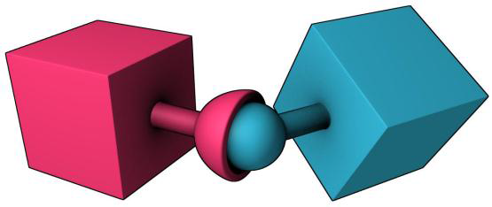
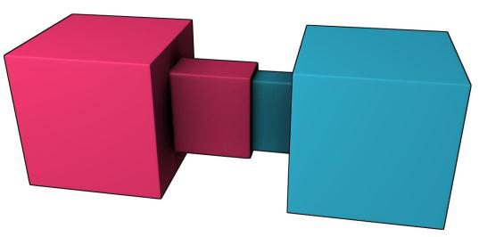
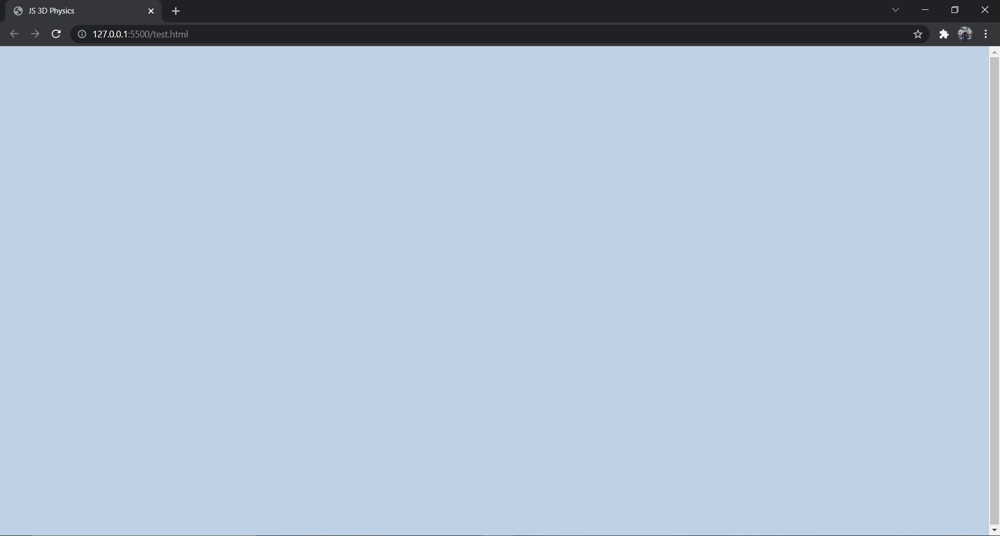

# Introduction to Physical Simulations with Three.js and Ammo.js

## Contents of the Presentation

* [Introduction to Ammo.js](#introduction-to-ammojs)
* [Terms in Ammo.js](#terms-in-ammojs)
* [Coding and Explanation](#coding-and-explanation)

---

## Introduction to Ammo.js

### What is Ammo.js 🤔

Ammo.js is one of the most powerful JavaScript Physics Engine available, created to help the user create two dimensional Physics Simulation to an object.
- Ammo.js has an interesting pedigree as it actually is a direct JavaScript port of *Bullet3D*.

- *Bullet3D* itself is a powerful open source C++ based Physics Engine which has been used in video games and also movies.

- **Ammo** actually stands for "Avoided Making My Own js physics engine by compiling BulletJs from C++". (No Jokes, try searching for it)

- The creator of Ammo.js is never stated, but the code can be found in the [Github Repository](https://github.com/kripken/ammo.js) created by an user **kripken** with 40+ Authors which contribute in the creation of this engine.

---

## Terms in Ammo.js

### Physical World 🌍

There has to be a world that obeys the laws of physics except that in a parallel Universe that has its own set of Physical Laws.
- The definition of Physical World simply means the world where the physics simulation will take place in.

- In Ammo.js this world is called a Collision World and has among its derivatives the Dynamic World.

- This physics world has options to set gravity and expose functions and objects so it can create a physics simulation within an objects.

---

### Rigid Body 

Physics is a study about matters, in which there has to be a body alongside with the mass, density, etc.  

- In ammo.js this body is called a **Collision Object** or a **Rigid Body** which moves, collides, has a mass and has an impulse applied to it.

- Rigid Body is idealised representation of a body in which deformation is ignored. This means that a shape which doesn't change, and can be manipulated via certain properties.

- The default rigid body is formless and it needed a shape to interact in Physical Simulation and calculate the *Inertia Tensor*.

Examples of **Rigid Body** 
* Position and orientation

* Linear velocity

* Angular velocity

* Forces and impulses

* Torques and torque impulses

---

### Types of Rigid Body

#### Rigid Body : Dynamic

Dynamic rigid bodies have mass greater than zero and will move around being affected by the forces and laws governing the physics world. The object will be affected by gravity, impulse, and would respond appropriately to collisions from other bodies.

Examples :
- Billiard/Snooker Game 
- FPS Shooting Game

#### Rigid Body : Static

Static rigid bodies are just what their name says which is static and can never be moved by the user. The requirements to be a static rigid body is having the mass of 0.

Examples :
- The Billiard Table
- The Ground

#### Rigid Body : Kinematic

Kinematic objects are static objects that can be moved by the user. The object will not be affected by any force from the physics world not even gravity, they are just there.

Example :
- A Floating Block in Minecraft

---

### Collision

Collision happens when two or more object encounters resulting in exchange or transformation of energy. In this Physics, there are 2 topics that covers the collision

#### Collision Detection

Collision Detection is about detecting when two or more objects collide.
Example :
- Deducting the health of the boss for every successful attack (The sword/bullet collide with the boss body).

#### Collision Filtering

Collision Filtering sets which objects should collide and which should not. This is important to set an object which can collide and which doesn't. In Ammo.js, *Masks* is used for this kind of condition.<br>
Every rigid body in ammo.js has a bitwise masks collision group and collision mask. The collision group represents the collision identity group of the rigid body while the collision mask represents other collision identity groups that should be collided with. 

Principal of Collision in Ammo.js is "**collision between two object can only occur if a bitwise AND operation between the collision mask of A and the collision group of B is anything but zero and vice versa.**"

Rigid Body  | Collision Group    | Collision Mask
------------|--------------------|----------------
A | 0010 | 0001
B | 0011 | 0010
C | 0101 | 0011

Can you determine which Rigid Body will collide and which won't?

---

### Constraints

A constraint component connects two rigid bodies together or connects a rigid body to a static point in the world. 
<br>
The types of joints supported by Ammo.js 
#### Point to Point (P2P)
Point to point constraint limits the translation so that the local pivot points of two rigid bodies match in worldspace. A chain of rigid bodies can be connected using this constraint.



#### Hinge Constraints

Hinge constraint/ Revolute joint restricts two additional angular degrees of freedom, so the body can only rotate around one axis, the hinge axis. This can be useful to represent doors or wheels rotating around one axis.


#### Slider Constraints

The slider constraint allows the body to rotate around one axis and translate along this axis.



#### Cone Twist Constraints

This is a special point to point constraint that adds cone and twist axis limits. x-axis serves as a twist axis. This is useful for making joints like the upper arm’s joint.

---
## Coding and Explanation

To demonstrate the Physical Simulation using Three.js and Ammo.js, Follow this 4 ~~distressing~~ simple steps!

#### 1. Setting Up Workspace with Three.js and Ammo.js

##### - Obtain Three.js Code File

The Code File of Three.js can be copied or forked from [Three.js Repository](https://threejs.org/build/three.js) , then paste it in a file “Three.js” or “Three.main.js” inside the folder "js" in the folder.

##### - Obtain Ammo.js Code File

The Code File of Ammo.js can be obtained by downloading the repository from [Ammo.js Repository](https://github.com/kripken/ammo.js), look up to the folder "build" and then extract/copy the file *ammo.js* to your desired folder and name it "ammo.js".

##### - Create HTML File
Next step is to make a HTML File in the folder of your desire, outside the folder "js" and then set it up to a usual HTML.
```html
<!DOCTYPE html>
<html lang="en">
<head>
    <meta charset="UTF-8">
    <meta http-equiv="X-UA-Compatible" content="IE=edge">
    <meta name="viewport" content="width=device-width, initial-scale=1.0">
    <title>Physics JS with Ammojs</title>
    <style>
        body 
        { 
            margin: 0; 
        }
    </style>
</head>
<body>
    <script src="js/three.js"></script>
    <script src="js/ammo.js"></script>
    <script>

        Ammo().then( start )
        
        function start()
        {

        }
    
    </script>
</body>
</html>
```

Code is represented as HTML with the part where Ammo.js is initialized through `Ammo()` which is a method that makes sure every necessary thing needed by ammo.js is initialized and ready to used. But, this initialization returns nothing in the browser, but if no errors are logged in the console then it’s good to go.


#### 2. Setting up Physical World

As the purpose setup Physical World as the place where the Physical Simulation will take places are

##### - Declare the variables

Declare the variable above the ammo.js Initialization 
```js 
let physicsWorld 
```

##### - Add the function to set up Physical World

Adding the function with the code below
```js
function setupPhysicsWorld()
{

    let collisionConfiguration  = new Ammo.btDefaultCollisionConfiguration(),
        dispatcher              = new Ammo.btCollisionDispatcher(collisionConfiguration),
        overlappingPairCache    = new Ammo.btDbvtBroadphase(),
        solver                  = new Ammo.btSequentialImpulseConstraintSolver();

    physicsWorld           = new Ammo.btDiscreteDynamicsWorld(dispatcher, overlappingPairCache, solver, collisionConfiguration);
    physicsWorld.setGravity(new Ammo.btVector3(0, -10, 0));

}
```
The explanation of the code above are :

###### Ammo.btDbvtBroadphase 

This function is used to implement a broad phase algorithm. Broad phase algorithm usually uses the bounding boxes of objects in the world to quickly compute a conservative approximate list of colliding pairs. The list will include every pair of objects that are colliding, but it may also include pairs of objects whose bounding boxes intersect but are still not close enough to collide.

###### Ammo.btDefaultCollisionConfiguration

The function is used to implement collision configuration which allows to fine tune the algorithms used for the full (not broadphase) collision detection.

###### Ammo.btCollisionDispatcher

The class collision dispatcher is used to register a callback that filters overlapping broadphase proxies so that the collisions are not processed by the rest of the system.

###### Ammo.btSequentialImpulseConstraintSolver

This class is what causes the objects to interact properly, taking into account gravity, game logic supplied forces, collisions, and hinge constraints.

###### Ammo.btDiscreteDynamicsWorld

This is the dynamic world, our physics world. It does come in other variants like ```js Ammo.btSoftRigidDynamicsWorld``` for soft body simulation.
From the last line we can see where we set the gravity of our world by calling ```js setGravity()``` method of physicsWorld and passing in an `ammojs vector3` for the gravity. 

##### - Add the call to the start() method 

Add a call in the empty start() ```js setupPhysicsWorld()``` 

##### - Add the function to Setup Graphics

Add a Three.js environment to add visuals by adding *scene*, *camera* and *renderer* above the ammo.js initialization

```js let physicsWorld, scene, camera, renderer;```

 After the function `setupPhysicsWorld`, add the function `setupGraphics()`

```js
function setupGraphics(){

    clock = new THREE.Clock();

    //create the scene
    scene = new THREE.Scene();
    scene.background = new THREE.Color( 0xffffff );

    //create camera
    camera = new THREE.PerspectiveCamera( 60, window.innerWidth / window.innerHeight, 0.2, 5000 );
    camera.position.set( 0, 30, 70 );
    camera.lookAt(new THREE.Vector3(0, 0, 0));

    //Add directional light
    let dirLight = new THREE.DirectionalLight( 0xffffff , 1);
    dirLight.color.setHSL( 0.1, 1, 0.95 );
    dirLight.position.set( -1, 1.75, 1 );
    dirLight.position.multiplyScalar( 100 );
    scene.add( dirLight );

    dirLight.castShadow = true;

    dirLight.shadow.mapSize.width = 2048;
    dirLight.shadow.mapSize.height = 2048;

    let d = 50;

    dirLight.shadow.camera.left = -d;
    dirLight.shadow.camera.right = d;
    dirLight.shadow.camera.top = d;
    dirLight.shadow.camera.bottom = -d;

    dirLight.shadow.camera.far = 13500;

    //Setup the renderer
    renderer = new THREE.WebGLRenderer( { antialias: true } );
    renderer.setClearColor( 0xbfd1e5 );
    renderer.setPixelRatio( window.devicePixelRatio );
    renderer.setSize( window.innerWidth, window.innerHeight );
    document.body.appendChild( renderer.domElement );

    renderer.gammaInput = true;
    renderer.gammaOutput = true;

    renderer.shadowMap.enabled = true;

}


function renderFrame(){

    let deltaTime = clock.getDelta();

    renderer.render( scene, camera );

    requestAnimationFrame( renderFrame );

}
```

##### - Invoke the function in start() method

Don't forget to invoke the function in the start() method 
`
function start ()
{
    setupPhysicsWorld();
    setupGraphics();
    renderFrame();
}
`

When running in web browser with live server, it should return the view like this 



#### 3. Rigid Body and Collision Shape 

#### 4. Collision Filtering
 
#### 5. Adding Constraints 

