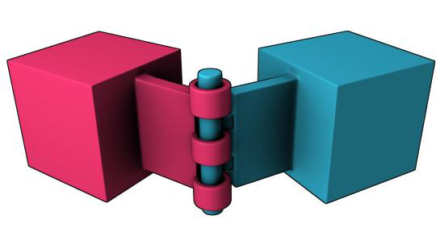

# Introduction to Physical Simulations with Three.js and Ammo.js

## Contents of the Presentation

* [Introduction to Ammo.js](#introduction-to-ammojs)
* [Terms in Ammo.js](#terms-in-ammojs)
* [Coding and Explanation](#coding-and-explanation)

---

## Introduction to Ammo.js

### What is Ammo.js 🤔

Ammo.js is one of the most powerful JavaScript Physics Engine available, created to help the user create two dimensional Physics Simulation to an object.
- Ammo.js has an interesting pedigree as it actually is a direct JavaScript port of *Bullet3D*.

- *Bullet3D* itself is a powerful open source C++ based Physics Engine which has been used in video games and also movies.

- **Ammo** actually stands for "Avoided Making My Own js physics engine by compiling BulletJs from C++". (No Jokes, try searching for it)

- The creator of Ammo.js is never stated, but the code can be found in the [Github Repository](https://github.com/kripken/ammo.js) created by an user **kripken** with 40+ Authors which contribute in the creation of this engine.

---

## Terms in Ammo.js

### Physical World 🌍

There has to be a world that obeys the laws of physics except that in a parallel Universe that has its own set of Physical Laws.
- The definition of Physical World simply means the world where the physics simulation will take place in.

- In Ammo.js this world is called a Collision World and has among its derivatives the Dynamic World.

- This physics world has options to set gravity and expose functions and objects so it can create a physics simulation within an objects.

---

### Rigid Body 

Physics is a study about matters, in which there has to be a body alongside with the mass, density, etc.  

- In ammo.js this body is called a **Collision Object** or a **Rigid Body** which moves, collides, has a mass and has an impulse applied to it.

- Rigid Body is idealised representation of a body in which deformation is ignored. This means that a shape which doesn't change, and can be manipulated via certain properties.

- The default rigid body is formless and it needed a shape to interact in Physical Simulation and calculate the *Inertia Tensor*.

Examples of **Rigid Body** 
* Position and orientation

* Linear velocity

* Angular velocity

* Forces and impulses

* Torques and torque impulses

---

### Types of Rigid Body

#### Rigid Body : Dynamic

Dynamic rigid bodies have mass greater than zero and will move around being affected by the forces and laws governing the physics world. The object will be affected by gravity, impulse, and would respond appropriately to collisions from other bodies.

Examples :
- Billiard/Snooker Game 
- FPS Shooting Game

#### Rigid Body : Static

Static rigid bodies are just what their name says which is static and can never be moved by the user. The requirements to be a static rigid body is having the mass of 0.

Examples :
- The Billiard Table
- The Ground

#### Rigid Body : Kinematic

Kinematic objects are static objects that can be moved by the user. The object will not be affected by any force from the physics world not even gravity, they are just there.

Example :
- A Floating Block in Minecraft

---

### Collision

Collision happens when two or more object encounters resulting in exchange or transformation of energy. In this Physics, there are 2 topics that covers the collision

#### Collision Detection

Collision Detection is about detecting when two or more objects collide.
Example :
- Deducting the health of the boss for every successful attack (The sword/bullet collide with the boss body).

#### Collision Filtering

Collision Filtering sets which objects should collide and which should not. This is important to set an object which can collide and which doesn't. In Ammo.js, *Masks* is used for this kind of condition.<br>
Every rigid body in ammo.js has a bitwise masks collision group and collision mask. The collision group represents the collision identity group of the rigid body while the collision mask represents other collision identity groups that should be collided with. 

Principal of Collision in Ammo.js is "**collision between two object can only occur if a bitwise AND operation between the collision mask of A and the collision group of B is anything but zero and vice versa.**"

Rigid Body  | Collision Group    | Collision Mask
------------|--------------------|----------------
A | 0010 | 0001
B | 0011 | 0010
C | 0101 | 0011

Can you determine which Rigid Body will collide and which won't?

---

### Constraints

A constraint component connects two rigid bodies together or connects a rigid body to a static point in the world. 
<br>
The types of joints supported by Ammo.js 
#### Point to Point (P2P)
Point to point constraint limits the translation so that the local pivot points of two rigid bodies match in worldspace. A chain of rigid bodies can be connected using this constraint.


#### Hinge Constraints

Hinge constraint/ Revolute joint restricts two additional angular degrees of freedom, so the body can only rotate around one axis, the hinge axis. This can be useful to represent doors or wheels rotating around one axis.



#### Slider Constraints

The slider constraint allows the body to rotate around one axis and translate along this axis.


#### Cone Twist Constraints

This is a special point to point constraint that adds cone and twist axis limits. x-axis serves as a twist axis. This is useful for making joints like the upper arm’s joint.

---
## Coding and Explanation

To demonstrate the Physical Simulation using Three.js and Ammo.js, Follow this 4 ~~distressing~~ simple steps!

#### 1. Setting Up Workspace with Three.js and Ammo.js

##### - Obtain Three.js Code File

The Code File of Three.js can be copied or forked from [Three.js Repository](https://threejs.org/build/three.js) , then paste it in a file “Three.js” or “Three.main.js” inside the folder "js" in the folder.

##### - Obtain Ammo.js Code File

The Code File of Ammo.js can be obtained by downloading the repository from [Ammo.js Repository](https://github.com/kripken/ammo.js), look up to the folder "build" and then extract/copy the file *ammo.js* to your desired folder and name it "ammo.js".

##### - Create HTML File
Next step is to make a HTML File in the folder of your desire, outside the folder "js" and then set it up to a usual HTML.
```html
<!DOCTYPE html>
<html lang="en">
<head>
    <meta charset="UTF-8">
    <meta http-equiv="X-UA-Compatible" content="IE=edge">
    <meta name="viewport" content="width=device-width, initial-scale=1.0">
    <title>Physics JS with Ammojs</title>
    <style>
        body 
        { 
            margin: 0; 
        }
    </style>
</head>
<body>
    <script src="js/three.js"></script>
    <script src="js/ammo.js"></script>
    <script>

        Ammo().then( start )
        
        function start()
        {

        }
    
    </script>
</body>
</html>
```

Code is represented as HTML with the part where Ammo.js is initialized through `Ammo()` which is a method that makes sure every necessary thing needed by ammo.js is initialized and ready to used. But, this initialization returns nothing in the browser, but if no errors are logged in the console then it’s good to go.


#### 2. Setting up Physical World

As the purpose setup Physical World as the place where the Physical Simulation will take places are

##### - Declare the variables

Declare the variable above the ammo.js Initialization 
```js 
let physicsWorld 
```

##### - Add the function to set up Physical World

Adding the function with the code below
```js
function setupPhysicsWorld()
{

    let collisionConfiguration  = new Ammo.btDefaultCollisionConfiguration(),
        dispatcher              = new Ammo.btCollisionDispatcher(collisionConfiguration),
        overlappingPairCache    = new Ammo.btDbvtBroadphase(),
        solver                  = new Ammo.btSequentialImpulseConstraintSolver();

    physicsWorld           = new Ammo.btDiscreteDynamicsWorld(dispatcher, overlappingPairCache, solver, collisionConfiguration);
    physicsWorld.setGravity(new Ammo.btVector3(0, -10, 0));

}
```

##### - Add the call to the start() method 

Add a call in the empty start() 
```js 
setupPhysicsWorld()
``` 

##### - Add the function to Setup Graphics

Add a Three.js environment to add visuals by adding *scene*, *camera* and *renderer* above the ammo.js initialization

```js 
let physicsWorld, scene, camera, renderer;
```

 After the function `setupPhysicsWorld`, add the function `setupGraphics()`

```js
function setupGraphics(){

    clock = new THREE.Clock();

    //create the scene
    scene = new THREE.Scene();
    scene.background = new THREE.Color( 0xffffff );

    //create camera
    camera = new THREE.PerspectiveCamera( 60, window.innerWidth / window.innerHeight, 0.2, 5000 );
    camera.position.set( 0, 30, 70 );
    camera.lookAt(new THREE.Vector3(0, 0, 0));

    //Add directional light
    let dirLight = new THREE.DirectionalLight( 0xffffff , 1);
    dirLight.color.setHSL( 0.1, 1, 0.95 );
    dirLight.position.set( -1, 1.75, 1 );
    dirLight.position.multiplyScalar( 100 );
    scene.add( dirLight );

    dirLight.castShadow = true;

    dirLight.shadow.mapSize.width = 2048;
    dirLight.shadow.mapSize.height = 2048;

    let d = 50;

    dirLight.shadow.camera.left = -d;
    dirLight.shadow.camera.right = d;
    dirLight.shadow.camera.top = d;
    dirLight.shadow.camera.bottom = -d;

    dirLight.shadow.camera.far = 13500;

    //Setup the renderer
    renderer = new THREE.WebGLRenderer( { antialias: true } );
    renderer.setClearColor( 0xbfd1e5 );
    renderer.setPixelRatio( window.devicePixelRatio );
    renderer.setSize( window.innerWidth, window.innerHeight );
    document.body.appendChild( renderer.domElement );

    renderer.gammaInput = true;
    renderer.gammaOutput = true;

    renderer.shadowMap.enabled = true;

}


function renderFrame(){

    let deltaTime = clock.getDelta();

    renderer.render( scene, camera );

    requestAnimationFrame( renderFrame );

}
```

##### - Invoke the function in start() method

Don't forget to invoke the function in the start() method 
```js
function start ()
{
    setupPhysicsWorld();
    setupGraphics();
    renderFrame();
}
```

When running in web browser with live server, it should return the view of the background aqua blue 


#### 3. Rigid Body and Collision Shape 

As stated before, rigid body is idealised representation of a body which moves, collides, has a mass and has an impulse applied to it. The important thing about the connection between rigid body and physical world is there has to be some kind of physical object which interacts with another object.<br>

The demonstration is making a simulation about creating a box plane model with a sphere falling from a height determined by users. Logically, there are two requirements about the box plane and sphere to this kind of model

- The box plane is made with box collision shape, and it should be static. Thus, the mass of the box plane should be 0.

- The sphere, which is a dynamic rigid body that are affected by gravity and other physical simulation should be given the mass bigger than 0.

Therefore, the steps that need to be followed are

##### - Declare the variable for rigid body

On the top of the code, declare the variable for rigid body in form of an array.
```js
rigidBodies = [], tmpTrans;
```

##### - Calling the transformation method inside the start() method

Next, inside the start() method, add the following code 
```js
tmpTrans = new Ammo.btTransform()
```

This code will serve as a collection for all three.js mesh and updated at each render loop. `tmpTrans` is used to temporarily transform objects that will be reused.


##### - Adding Function to create the box plane and the ball

The next step should be creating the boxplane and the ball which the physics simulation will take place

```js
function createBlock(){
    
    let pos = {x: 0, y: 0, z: 0};
    let scale = {x: 80, y: 2, z: 80};
    let quat = {x: 0, y: 0, z: 0, w: 1};
    let mass = 0;

    //threeJS Section
    let blockPlane = new THREE.Mesh(new THREE.BoxBufferGeometry(), new THREE.MeshPhongMaterial({color: 0x7a7a7a}));

    blockPlane.position.set(pos.x, pos.y, pos.z);
    blockPlane.scale.set(scale.x, scale.y, scale.z);

    blockPlane.castShadow = true;
    blockPlane.receiveShadow = true;

    scene.add(blockPlane);


    //Ammojs Section
    let transform = new Ammo.btTransform();
    transform.setIdentity();
    transform.setOrigin( new Ammo.btVector3( pos.x, pos.y, pos.z ) );
    transform.setRotation( new Ammo.btQuaternion( quat.x, quat.y, quat.z, quat.w ) );
    let motionState = new Ammo.btDefaultMotionState( transform );

    let colShape = new Ammo.btBoxShape( new Ammo.btVector3( scale.x * 0.5, scale.y * 0.5, scale.z * 0.5 ) );
    colShape.setMargin( 0.05 );

    let localInertia = new Ammo.btVector3( 0, 0, 0 );
    colShape.calculateLocalInertia( mass, localInertia );

    let rbInfo = new Ammo.btRigidBodyConstructionInfo( mass, motionState, colShape, localInertia );
    let body = new Ammo.btRigidBody( rbInfo );


    physicsWorld.addRigidBody( body );
}


function createBall(){
    
    let pos = {x: 0, y: 20, z: 0};
    let radius = 2;
    let quat = {x: 0, y: 0, z: 0, w: 1};
    let mass = 1;

    //threeJS Section
    let ball = new THREE.Mesh(new THREE.SphereBufferGeometry(radius), new THREE.MeshPhongMaterial({color: 0xffffff}));

    ball.position.set(pos.x, pos.y, pos.z);
    
    ball.castShadow = true;
    ball.receiveShadow = true;

    scene.add(ball);


    //Ammojs Section
    let transform = new Ammo.btTransform();
    transform.setIdentity();
    transform.setOrigin( new Ammo.btVector3( pos.x, pos.y, pos.z ) );
    transform.setRotation( new Ammo.btQuaternion( quat.x, quat.y, quat.z, quat.w ) );
    let motionState = new Ammo.btDefaultMotionState( transform );

    let colShape = new Ammo.btSphereShape( radius );
    colShape.setMargin( 0.05 );

    let localInertia = new Ammo.btVector3( 0, 0, 0 );
    colShape.calculateLocalInertia( mass, localInertia );

    let rbInfo = new Ammo.btRigidBodyConstructionInfo( mass, motionState, colShape, localInertia );
    let body = new Ammo.btRigidBody( rbInfo );


    physicsWorld.addRigidBody( body );
    
    ball.userData.physicsBody = body;
    rigidBodies.push(ball);
}
```

At the **Ammo.js** section, first, a rigid body is created and set to transform through the code `Ammo.btTransform` object from which the motion state was created which help obtain the transform of a physics body and to equally set it. Next, a collision shape is created by passing in the respective dimensions of the three.js objects which is Box shape for the block and Sphere for the ball. <br>

The essence of these objects is to be able to create multiple rigid bodies with the same properties.<br>

For the `createBall` method, after the rigid body is added to the physics world, it is also added to the `userData` object property of the three.js ball created.


##### - Adding the function to update physics for each rigid body

Below the final method created, add the function updatePhysics()
```js
function updatePhysics( deltaTime ){

    physicsWorld.stepSimulation( deltaTime, 10 );

    // Update rigid bodies
    for ( let i = 0; i < rigidBodies.length; i++ ) {
        let objThree = rigidBodies[ i ];
        let objAmmo = objThree.userData.physicsBody;
        let ms = objAmmo.getMotionState();
        if ( ms ) {

            ms.getWorldTransform( tmpTrans );
            let p = tmpTrans.getOrigin();
            let q = tmpTrans.getRotation();
            objThree.position.set( p.x(), p.y(), p.z() );
            objThree.quaternion.set( q.x(), q.y(), q.z(), q.w() );

        }
    }
```
Before, it is stated that in the `createBall` method, the rigid body is added to the `userData` object property after it is added to physics world. This is because this three.js ball is in turn added to the `rigidBodies` array so it can be retrieved when updating objects after a physics simulation. As the elapsed time is passed as a parameter to be sent to the `stepSimulation` method, it runs a simulation for the elapsed time updating the various transforms of the respective physics bodies. Then it will  loop through the `rigidBodies` array for each three.js object associated with ammo.js rigid body, obtain the world transform and finally apply the obtained transform to the three.js.

##### - Call the createBall and createBallMasks in start() method

Calling the `createBall` and `createBallMasks` after the `setupGraphics()` method and before the `renderFrame()` method.
```js
 function start (){

                tmpTrans = new Ammo.btTransform();

                setupPhysicsWorld();

                setupGraphics();
                createBlock();
                createBall();
                createMaskBall();

                renderFrame();

            }
```

##### - Update the renderFrame() method

Finally, call `updatePhysics` in the renderFrame method just before the `render.render(…)` function statement by passing in the `deltaTime` variable to it.
```js
 function renderFrame(){

                let deltaTime = clock.getDelta();

                updatePhysics( deltaTime );

                renderer.render( scene, camera );

                requestAnimationFrame( renderFrame );

            }            
```

##### The final result for this section will be a white ball that is standing on a box plane


#### 4. Collision Filtering

 Since the scenes are going to be added by another ball is to demonstrate the collision filtering. The steps below must be followed.
 
##### - Declaring variables for the used collision group

On the top of the code together with other variables, declare the collision group variable
```js
let colGroupPlane = 1, colGroupWhiteBall = 2, colGroupBlackBall = 4
```

##### - Create method `createMaskBall()`

Next, create a method/function `createMaskBall()` after the `createBall()` method
```js
function createMaskBall(){
                
                let pos = {x: 1, y: 30, z: 0};
                let radius = 2;
                let quat = {x: 0, y: 0, z: 0, w: 2};
                let mass = 1;

                //threeJS Section
                let ball = new THREE.Mesh(new THREE.SphereBufferGeometry(radius), new THREE.MeshPhongMaterial({color: 00000}));

                ball.position.set(pos.x, pos.y, pos.z);
                
                ball.castShadow = true;
                ball.receiveShadow = true;

                scene.add(ball);


                //Ammojs Section
                let transform = new Ammo.btTransform();
                transform.setIdentity();
                transform.setOrigin( new Ammo.btVector3( pos.x, pos.y, pos.z ) );
                transform.setRotation( new Ammo.btQuaternion( quat.x, quat.y, quat.z, quat.w ) );
                let motionState = new Ammo.btDefaultMotionState( transform );

                let colShape = new Ammo.btSphereShape( radius );
                colShape.setMargin( 0.05 );

                let localInertia = new Ammo.btVector3( 0, 0, 0 );
                colShape.calculateLocalInertia( mass, localInertia );

                let rbInfo = new Ammo.btRigidBodyConstructionInfo( mass, motionState, colShape, localInertia );
                let body = new Ammo.btRigidBody( rbInfo );


                physicsWorld.addRigidBody( body, colGroupBlackBall, colGroupWhiteBall | colGroupPlane);
                
                ball.userData.physicsBody = body;
                rigidBodies.push(ball);
            }

```

This method will create a simillar ball but with the position of the ball that has been translated 30 units along the positive y axis and 1 units along the x axis. <br>
As we can see there is also a difference in the `addRigidBody()` method with this give 3 parameters `addRigidBody( body, colGroupBlackBall, colGroupWhiteBall | colGroupPlane);` instead of just `addRigidBody( body);`. This is due to the first of these two parameters is for the collision group of the rigid body while the second is for the collision mask where the other should collide with, where here means the BlackBall should collide with WhiteBall collision group and the group plane which is the box plane.

##### - Modifying each object's `addRigidBody()` method

As stated above, instead of just returning the `addRigidBody(body)`, the collision which for both balls and the box plane should happen. Therefore, a modification should be make as stated below.

- In the method `createBlock()`, change the code 
```js
physicsWorld.addRigidBody(body);
```
to
```js
physicsWorld.addRigidBody(body, colGroupPlane, colGroupWhiteBall | colGroupBlackBall)
```

- In the method `createBall()`, change the code 
```js
physicsWorld.addRigidBody(body);
```
to
```js
physicsWorld.addRigidBody( body, colGroupWhiteBall, colGroupPlane | colGroupBlackBall)
```

##### - Call the `createMaskBall()` method in the `start()` method

Finally, don't ever forget to call the method `createMaskBall()` in the `start()` method so the object can be added into the scene.

```js
function start (){

                tmpTrans = new Ammo.btTransform();

                setupPhysicsWorld();

                setupGraphics();
                createBlock();
                createBall();
                createMaskBall();

                renderFrame();

            }

```

Finally, the scene should have 2 balls that falls in a different height, and collide with each other as well as the box plane.<br>

 
#### 5. Adding Constraints 

For demonstrating adding constraints, the steps are

##### - Create method `createJoinObject()` 
This method should be added to the code right after the `createMaskBall()` method with the code below.
```js
function createJointObjects(){
    
    let pos1 = {x: -1, y: 15, z: 0};
    let pos2 = {x: -1, y: 10, z: 0};

    let radius = 2;
    let scale = {x: 5, y: 2, z: 2};
    let quat = {x: 0, y: 0, z: 0, w: 1};
    let mass1 = 0;
    let mass2 = 1;

    let transform = new Ammo.btTransform();

    //Sphere Graphics
    let ball = new THREE.Mesh(new THREE.SphereBufferGeometry(radius), new THREE.MeshPhongMaterial({color: 0xb846db}));

    ball.position.set(pos1.x, pos1.y, pos1.z);

    ball.castShadow = true;
    ball.receiveShadow = true;

    scene.add(ball);


    //Sphere Physics
    transform.setIdentity();
    transform.setOrigin( new Ammo.btVector3( pos1.x, pos1.y, pos1.z ) );
    transform.setRotation( new Ammo.btQuaternion( quat.x, quat.y, quat.z, quat.w ) );
    let motionState = new Ammo.btDefaultMotionState( transform );

    let sphereColShape = new Ammo.btSphereShape( radius );
    sphereColShape.setMargin( 0.05 );

    let localInertia = new Ammo.btVector3( 0, 0, 0 );
    sphereColShape.calculateLocalInertia( mass1, localInertia );

    let rbInfo = new Ammo.btRigidBodyConstructionInfo( mass1, motionState, sphereColShape, localInertia );
    let sphereBody = new Ammo.btRigidBody( rbInfo );

    physicsWorld.addRigidBody( sphereBody, colGroupGreenBall, colGroupRedBall );

    ball.userData.physicsBody = sphereBody;
    rigidBodies.push(ball);
    

    //Block Graphics
    let block = new THREE.Mesh(new THREE.BoxBufferGeometry(), new THREE.MeshPhongMaterial({color: 0xf78a1d}));

    block.position.set(pos2.x, pos2.y, pos2.z);
    block.scale.set(scale.x, scale.y, scale.z);

    block.castShadow = true;
    block.receiveShadow = true;

    scene.add(block);


    //Block Physics
    transform.setIdentity();
    transform.setOrigin( new Ammo.btVector3( pos2.x, pos2.y, pos2.z ) );
    transform.setRotation( new Ammo.btQuaternion( quat.x, quat.y, quat.z, quat.w ) );
    motionState = new Ammo.btDefaultMotionState( transform );

    let blockColShape = new Ammo.btBoxShape( new Ammo.btVector3( scale.x * 0.5, scale.y * 0.5, scale.z * 0.5 ) );
    blockColShape.setMargin( 0.05 );

    localInertia = new Ammo.btVector3( 0, 0, 0 );
    blockColShape.calculateLocalInertia( mass2, localInertia );

    rbInfo = new Ammo.btRigidBodyConstructionInfo( mass2, motionState, blockColShape, localInertia );
    let blockBody = new Ammo.btRigidBody( rbInfo );

    physicsWorld.addRigidBody( blockBody, colGroupGreenBall, colGroupRedBall );
    
    block.userData.physicsBody = blockBody;
    rigidBodies.push(block);


    //Create Joints
    let spherePivot = new Ammo.btVector3( 0, - radius, 0 );
    let blockPivot = new Ammo.btVector3( - scale.x * 0.5, 1, 1 );

    let p2p = new Ammo.btPoint2PointConstraint( sphereBody, blockBody, spherePivot, blockPivot);
    physicsWorld.addConstraint( p2p, false );
}
```

This code demonstrate the joints as it will create a ball and a sphere below swirling around. What this program does is creating pivot points for the respective objects where the joining would be established and should be relative to the origin of the object. A point2point (P2P) constraint was created next by passing the two objects and also their respective pivot points to its constructor.<br>

##### - Call the createJoinObject method in start() method

Never forget to call `createJoinObject()` after the `setupGraphics()` method and before the `renderFrame()` method.
```js
 function start (){

                tmpTrans = new Ammo.btTransform();

                setupPhysicsWorld();

                setupGraphics();
                createBlock();
                createBall();
                createMaskBall();
                createJoinObject();

                renderFrame();
                }
```

The Final Result should be a view like the gif below<br>


The Final Code can be found [Here](https://gist.github.com/vincentyonathan/bd94a2d3c2c9a88927c52601d98831a4)
