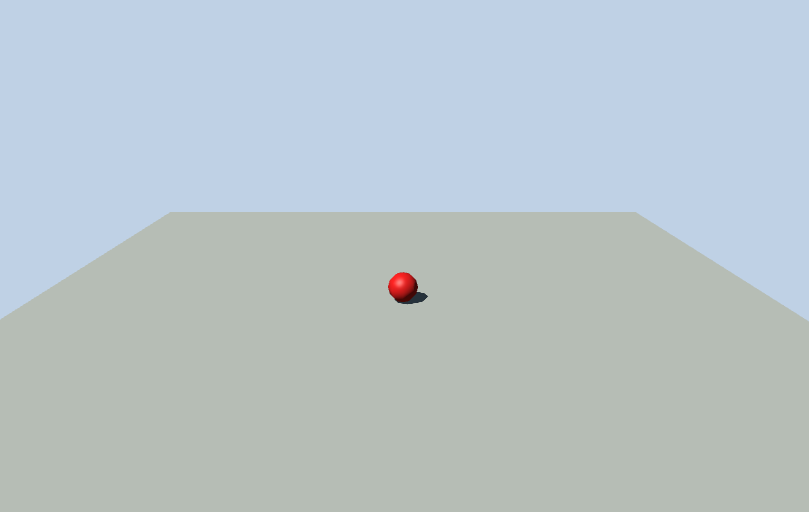
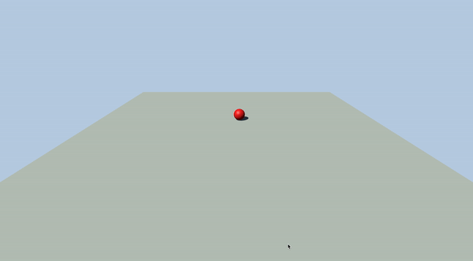
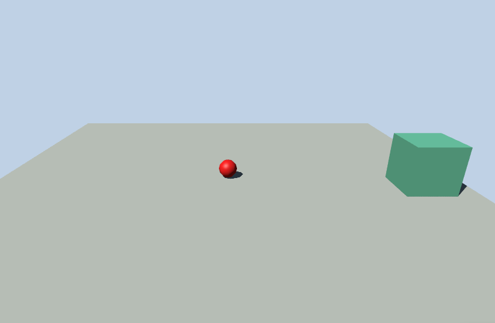

# Moving Objects In JavaScript 3D Physics using Ammo.js and Three.js

So, from the earlier explanation, we've seen how to setup physics world, add objects to it and even filter collisions using masks,
but what if you wanted to move the object around, how would you go about it? For example, in a game, you want your character to move
while the walk animation is playing or you need a floating block that would act as a platform to help a player cross a dangerous sea of lava.

To be able to achieve this we'd have to revisit some fundamentals.

## Dynamic, Static and Kinematic Rigid Bodies

Quoting from bullet user manual:
There are 3 different types of objects in Bullet

- Dynamic (moving) rigid bodies: positive mass, every simulation frame the dynamics will update its world transform.
- Static rigid bodies: zero mass, cannot move but just collide.
- Kinematic rigid bodies: zero mass, can be animated by the user, but there will be only one way interaction:
  dynamic objects will be pushed away but there is no influence from dynamic objects.

### Dynamic Rigid Bodies

Dynamic rigid bodies have mass greater than zero and will move around being affected by the forces and laws governing the physics world.
This means they will be affected by gravity, impulse, and would respond appropriately to collisions from other bodies.
To move a dynamic rigid body you either use `applyForce`, `applyImpulse` or `setLinearVelocity`. These are all rigid body methods.

`applyForce` and `applyImpulse` would result in a body acceleration, so your characters will have momentum,
but for this time we will only use `setLinearVelocity`.

We will be creating an example to demonstrate this. Our example will consist of a ball that can be moved around using the WASD keys.

Go ahead and create a .html file in the workspace and copy the code below.

```html
<html>
  <head>
    <meta charset="utf-8" />
    <title>Move JS 3D Physics</title>
    <style>
      body {
        margin: 0;
      }
    </style>
  </head>
  <body>
    <script src="js/three.js"></script>
    <script src="js/ammo.js"></script>
    <script>
      //variable declaration section
      let physicsWorld,
        scene,
        camera,
        renderer,
        rigidBodies = [],
        tmpTrans = null;

      //Ammojs Initialization
      Ammo().then(start);

      function start() {
        tmpTrans = new Ammo.btTransform();

        setupPhysicsWorld();

        setupGraphics();
        createBlock();
        createBall();

        renderFrame();
      }

      function setupPhysicsWorld() {
        let collisionConfiguration = new Ammo.btDefaultCollisionConfiguration(),
          dispatcher = new Ammo.btCollisionDispatcher(collisionConfiguration),
          overlappingPairCache = new Ammo.btDbvtBroadphase(),
          solver = new Ammo.btSequentialImpulseConstraintSolver();

        physicsWorld = new Ammo.btDiscreteDynamicsWorld(
          dispatcher,
          overlappingPairCache,
          solver,
          collisionConfiguration
        );
        physicsWorld.setGravity(new Ammo.btVector3(0, -10, 0));
      }

      function setupGraphics() {
        //create clock for timing
        clock = new THREE.Clock();

        //create the scene
        scene = new THREE.Scene();
        scene.background = new THREE.Color(0xbfd1e5);

        //create camera
        camera = new THREE.PerspectiveCamera(
          60,
          window.innerWidth / window.innerHeight,
          0.2,
          5000
        );
        camera.position.set(0, 30, 70);
        camera.lookAt(new THREE.Vector3(0, 0, 0));

        //Add hemisphere light
        let hemiLight = new THREE.HemisphereLight(0xffffff, 0xffffff, 0.1);
        hemiLight.color.setHSL(0.6, 0.6, 0.6);
        hemiLight.groundColor.setHSL(0.1, 1, 0.4);
        hemiLight.position.set(0, 50, 0);
        scene.add(hemiLight);

        //Add directional light
        let dirLight = new THREE.DirectionalLight(0xffffff, 1);
        dirLight.color.setHSL(0.1, 1, 0.95);
        dirLight.position.set(-1, 1.75, 1);
        dirLight.position.multiplyScalar(100);
        scene.add(dirLight);

        dirLight.castShadow = true;

        dirLight.shadow.mapSize.width = 2048;
        dirLight.shadow.mapSize.height = 2048;

        let d = 50;

        dirLight.shadow.camera.left = -d;
        dirLight.shadow.camera.right = d;
        dirLight.shadow.camera.top = d;
        dirLight.shadow.camera.bottom = -d;

        dirLight.shadow.camera.far = 13500;

        //Setup the renderer
        renderer = new THREE.WebGLRenderer({ antialias: true });
        renderer.setClearColor(0xbfd1e5);
        renderer.setPixelRatio(window.devicePixelRatio);
        renderer.setSize(window.innerWidth, window.innerHeight);
        document.body.appendChild(renderer.domElement);

        renderer.gammaInput = true;
        renderer.gammaOutput = true;

        renderer.shadowMap.enabled = true;
      }

      function renderFrame() {
        let deltaTime = clock.getDelta();

        updatePhysics(deltaTime);

        renderer.render(scene, camera);

        requestAnimationFrame(renderFrame);
      }

      function createBlock() {
        let pos = { x: 0, y: 0, z: 0 };
        let scale = { x: 100, y: 2, z: 100 };
        let quat = { x: 0, y: 0, z: 0, w: 1 };
        let mass = 0;

        //threeJS Section
        let blockPlane = new THREE.Mesh(
          new THREE.BoxBufferGeometry(),
          new THREE.MeshPhongMaterial({ color: 0xa0afa4 })
        );

        blockPlane.position.set(pos.x, pos.y, pos.z);
        blockPlane.scale.set(scale.x, scale.y, scale.z);

        blockPlane.castShadow = true;
        blockPlane.receiveShadow = true;

        scene.add(blockPlane);

        //Ammojs Section
        let transform = new Ammo.btTransform();
        transform.setIdentity();
        transform.setOrigin(new Ammo.btVector3(pos.x, pos.y, pos.z));
        transform.setRotation(
          new Ammo.btQuaternion(quat.x, quat.y, quat.z, quat.w)
        );
        let motionState = new Ammo.btDefaultMotionState(transform);

        let colShape = new Ammo.btBoxShape(
          new Ammo.btVector3(scale.x * 0.5, scale.y * 0.5, scale.z * 0.5)
        );
        colShape.setMargin(0.05);

        let localInertia = new Ammo.btVector3(0, 0, 0);
        colShape.calculateLocalInertia(mass, localInertia);

        let rbInfo = new Ammo.btRigidBodyConstructionInfo(
          mass,
          motionState,
          colShape,
          localInertia
        );
        let body = new Ammo.btRigidBody(rbInfo);

        body.setFriction(4);
        body.setRollingFriction(10);

        physicsWorld.addRigidBody(body);
      }

      function createBall() {
        let pos = { x: 0, y: 4, z: 0 };
        let radius = 2;
        let quat = { x: 0, y: 0, z: 0, w: 1 };
        let mass = 1;

        //threeJS Section
        let ball = new THREE.Mesh(
          new THREE.SphereBufferGeometry(radius),
          new THREE.MeshPhongMaterial({ color: 0xff0505 })
        );

        ball.position.set(pos.x, pos.y, pos.z);

        ball.castShadow = true;
        ball.receiveShadow = true;

        scene.add(ball);

        //Ammojs Section
        let transform = new Ammo.btTransform();
        transform.setIdentity();
        transform.setOrigin(new Ammo.btVector3(pos.x, pos.y, pos.z));
        transform.setRotation(
          new Ammo.btQuaternion(quat.x, quat.y, quat.z, quat.w)
        );
        let motionState = new Ammo.btDefaultMotionState(transform);

        let colShape = new Ammo.btSphereShape(radius);
        colShape.setMargin(0.05);

        let localInertia = new Ammo.btVector3(0, 0, 0);
        colShape.calculateLocalInertia(mass, localInertia);

        let rbInfo = new Ammo.btRigidBodyConstructionInfo(
          mass,
          motionState,
          colShape,
          localInertia
        );
        let body = new Ammo.btRigidBody(rbInfo);

        body.setFriction(4);
        body.setRollingFriction(10);

        physicsWorld.addRigidBody(body);

        ball.userData.physicsBody = body;
        rigidBodies.push(ball);
      }

      function updatePhysics(deltaTime) {
        // Step world
        physicsWorld.stepSimulation(deltaTime, 10);

        // Update rigid bodies
        for (let i = 0; i < rigidBodies.length; i++) {
          let objThree = rigidBodies[i];
          let objAmmo = objThree.userData.physicsBody;
          let ms = objAmmo.getMotionState();
          if (ms) {
            ms.getWorldTransform(tmpTrans);
            let p = tmpTrans.getOrigin();
            let q = tmpTrans.getRotation();
            objThree.position.set(p.x(), p.y(), p.z());
            objThree.quaternion.set(q.x(), q.y(), q.z(), q.w());
          }
        }
      }
    </script>
  </body>
</html>
```

If you view this in your browser you’ll see a plane with a red ball on it.



Under the variable declaration section of the code add:

```js
let ballObject = null,
moveDirection = { left: 0, right: 0, forward: 0, back: 0 }const STATE = { DISABLE_DEACTIVATION : 4 }
```

`ballObject` will be our handle to the ball and `moveDirection` will be used to hold the respective directional key (WASD) that is pressed.
Constant `STATE` is compiler-defined in the bullet source file (btCollissionObject.h).
When a rigid body is no longer participating in dynamic interaction in the physics world, ammo.js deactivates it. In this deactivated state we won’t be able to apply force to it. To stop this from happening, set the activation state for the rigid body to `STATE.DISABLE_DEACTIVATION`.

Back to the code. Go to definition of createBall method and change the line that has:

```js
let ball = new THREE.Mesh(
  new THREE.SphereBufferGeometry(radius),
  new THREE.MeshPhongMaterial({ color: 0xff0505 })
);
```

to

```js
let ball = (ballObject = new THREE.Mesh(
  new THREE.SphereBufferGeometry(radius),
  new THREE.MeshPhongMaterial({ color: 0xff0505 })
));
```

This sets the `ballObject` as a handle to the ball that we created.

We are not done yet. After the line that says

```js
body.setRollingFriction(10);
```

add this line

```js
body.setActivationState(STATE.DISABLE_DEACTIVATION);
```

Next is to handle `keydown` and `keyup` events for the WASD keyboard keys.

Copy and paste the below snippet after `renderFrame()` method definition:

```js
function setupEventHandlers() {
  window.addEventListener("keydown", handleKeyDown, false);
  window.addEventListener("keyup", handleKeyUp, false);
}

function handleKeyDown(event) {
  let keyCode = event.keyCode;

  switch (keyCode) {
    case 87: //W: FORWARD
      moveDirection.forward = 1;
      break;

    case 83: //S: BACK
      moveDirection.back = 1;
      break;

    case 65: //A: LEFT
      moveDirection.left = 1;
      break;

    case 68: //D: RIGHT
      moveDirection.right = 1;
      break;
  }
}

function handleKeyUp(event) {
  let keyCode = event.keyCode;

  switch (keyCode) {
    case 87: //FORWARD
      moveDirection.forward = 0;
      break;

    case 83: //BACK
      moveDirection.back = 0;
      break;

    case 65: //LEFT
      moveDirection.left = 0;
      break;

    case 68: //RIGHT
      moveDirection.right = 0;
      break;
  }
}
```

The above wires the keyboard’s `keydown` and `keyup` events to appropriate event handlers that are also defined in the snippet.
How the event handlers work is to set a key’s `moveDirection` component to 1 when the key is pressed (`handleKeyDown()`) and to 0 when released (`handleKeyUp()`).

We then call this newly added `setupEventHandlers()` method inside `start()` method at the top, right before the invocation of `renderFrame(`). Your `start()` method should look like :

```js
function start() {
  tmpTrans = new Ammo.btTransform();

  setupPhysicsWorld();

  setupGraphics();
  createBlock();
  createBall();

  setupEventHandlers();
  renderFrame();
}
```

Now to actually move the ball we have to:

- first resolve the directions set in `moveDirection` variable
- set a vector with the resolved directions
- multiply the vector by a scaling factor
- then apply the vector as the linear velocity of the ball's rigid body

All these are contained in the the `moveBall()` method below. Paste it into your code after `createBall()` method definition.

```js
function moveBall() {
  let scalingFactor = 20;

  let moveX = moveDirection.right - moveDirection.left;
  let moveZ = moveDirection.back - moveDirection.forward;
  let moveY = 0;

  if (moveX == 0 && moveY == 0 && moveZ == 0) return;

  let resultantImpulse = new Ammo.btVector3(moveX, moveY, moveZ);
  resultantImpulse.op_mul(scalingFactor);

  let physicsBody = ballObject.userData.physicsBody;
  physicsBody.setLinearVelocity(resultantImpulse);
}
```

On `renderFrame()` method body add a call to `moveBall()` just after the line that has

```js
let deltaTime = clock.getDelta();
```

`renderFrame()` should now look like:

```
function renderFrame(){
   let deltaTime = clock.getDelta();
   moveBall();
   updatePhysics( deltaTime );
   renderer.render( scene, camera );
   requestAnimationFrame( renderFrame );
}
```

Code implementation is done and the red ball should be moving based on WASD keys.



### Static Rigid Body

Static rigid bodies, which have a mass of zero, are just what their name says . They should never be moved by the user.

### Kinematic Rigid Body

Quoting from bullet user manual:

If you plan to animate or move static objects, you should flag them as kinematic. Also disable the sleeping/deactivation for them during the animation. This means Bullet (ammo.js) dynamics world will get the new worldtransform from the btMotionState every simulation frame.

Kinematic objects are static objects that can be moved, but by the user. They are not affected by any force from the physics world not even gravity, they are just there.

Since kinematic bodies are not affected by forces in the physics world it means we cannot use `applyForce` to move them, neither can we use `applyImpulse` nor `setLinearVelocity`. To move a kinematic rigid body, you have to set its physics world transform (position and rotation) from your 3d world. So while in the case of dynamic rigid bodies we get the current position and rotation from the physics world and update our 3d objects, in kinematic rigid bodies reverse is the case: get the current position and rotation from our 3d objects and update the physics objects.

To demonstrate this we will add a kinematic box to our scene to be moved around using the arrow keys (←↑↓→).

Back to our code. Under the variable declaration section add:

```js
let kObject = null,
  kMoveDirection = { left: 0, right: 0, forward: 0, back: 0 },
  tmpPos = new THREE.Vector3(),
  tmpQuat = new THREE.Quaternion();
```

`kObject` will be our handle to the kinematic object while `kMoveDirectio`, just like `moveDirection` will hold the keypress direction for moving the kinematic object. `tmpPos` and `tmpQuat` are temporary vector and quaternion respectively.

Still in this section, we're going to add `const FLAGS = { CF_KINEMATIC_OBJECT: 2 }`

When a rigid body is flagged as kinematic using `FLAGS.CF_KINEMATIC_OBJECT`, ammo.js will treat is as such.

Next up is to create our kinematic box, add this code after `createBall()` method definition:

```js
function createKinematicBox() {
  let pos = { x: 40, y: 6, z: 5 };
  let scale = { x: 10, y: 10, z: 10 };
  let quat = { x: 0, y: 0, z: 0, w: 1 };
  let mass = 0;

  //threeJS Section
  kObject = new THREE.Mesh(
    new THREE.BoxBufferGeometry(),
    new THREE.MeshPhongMaterial({ color: 0x30ab78 })
  );

  kObject.position.set(pos.x, pos.y, pos.z);
  kObject.scale.set(scale.x, scale.y, scale.z);

  kObject.castShadow = true;
  kObject.receiveShadow = true;

  scene.add(kObject);

  //Ammojs Section
  let transform = new Ammo.btTransform();
  transform.setIdentity();
  transform.setOrigin(new Ammo.btVector3(pos.x, pos.y, pos.z));
  transform.setRotation(new Ammo.btQuaternion(quat.x, quat.y, quat.z, quat.w));
  let motionState = new Ammo.btDefaultMotionState(transform);

  let colShape = new Ammo.btBoxShape(
    new Ammo.btVector3(scale.x * 0.5, scale.y * 0.5, scale.z * 0.5)
  );
  colShape.setMargin(0.05);

  let localInertia = new Ammo.btVector3(0, 0, 0);
  colShape.calculateLocalInertia(mass, localInertia);

  let rbInfo = new Ammo.btRigidBodyConstructionInfo(
    mass,
    motionState,
    colShape,
    localInertia
  );
  let body = new Ammo.btRigidBody(rbInfo);

  body.setFriction(4);
  body.setRollingFriction(10);

  body.setActivationState(STATE.DISABLE_DEACTIVATION);
  body.setCollisionFlags(FLAGS.CF_KINEMATIC_OBJECT);

  physicsWorld.addRigidBody(body);
  kObject.userData.physicsBody = body;
}
```

There are not many differences between this and others we’ve been using to create physics objects except for the line highlighted below that flags it as a kinematic object:

```js
body.setActivationState(STATE.DISABLE_DEACTIVATION);
body.setCollisionFlags(FLAGS.CF_KINEMATIC_OBJECT);
```

Now call `createKinematicBox()` from `start()` method after `createBall()` method.
Your `start()` method should currently look like this:

```js
function start() {
  tmpTrans = new Ammo.btTransform();
  setupPhysicsWorld();
  setupGraphics();
  createBlock();
  createBall();
  createKinematicBox();
  setupEventHandlers();
  renderFrame();
}
```

If you check your browser at this stage you should see our box right there in the scene. Try moving the ball against it and notice that it is not affected by the collision.



Now to the important part. Moving the box.

Let’s handle the `keydown` and `keyup` of the keyboard’s arrow keys. Add the below code to the switch…case statement in `handleKeyDown()`:

```js
case 38: //↑: FORWARD
   kMoveDirection.forward = 1
   break;

case 40: //↓: BACK
   kMoveDirection.back = 1
   break;

case 37: //←: LEFT
   kMoveDirection.left = 1
   break;

case 39: //→: RIGHT
   kMoveDirection.right = 1
   break;
```

Then add the following code to that of `handleKeyUp()`:

```js
case 38: //↑: FORWARD
   kMoveDirection.forward = 0
   break;

case 40: //↓: BACK
   kMoveDirection.back = 0
   break;

case 37: //←: LEFT
   kMoveDirection.left = 0
   break;

case 39: //→: RIGHT
   kMoveDirection.right = 0
   break;
```

Before adding the method to move our kinematic box, let’s put in place some helpful variables.

To the variable declaration section, add

```js
let ammoTmpPos = null,
  ammoTmpQuat = null;
```

Proceed to `start()` method, after the line that has

```js
tmpTrans = new Ammo.btTransform();
```

add

```js
ammoTmpPos = new Ammo.btVector3();
ammoTmpQuat = new Ammo.btQuaternion();
```

It’s time to finally move our kinematic box.

Paste the following method definition after that of `moveBall`:

```js
function moveKinematic() {
  let scalingFactor = 0.3;

  let moveX = kMoveDirection.right - kMoveDirection.left;
  let moveZ = kMoveDirection.back - kMoveDirection.forward;
  let moveY = 0;

  let translateFactor = tmpPos.set(moveX, moveY, moveZ);

  translateFactor.multiplyScalar(scalingFactor);

  kObject.translateX(translateFactor.x);
  kObject.translateY(translateFactor.y);
  kObject.translateZ(translateFactor.z);

  kObject.getWorldPosition(tmpPos);
  kObject.getWorldQuaternion(tmpQuat);

  let physicsBody = kObject.userData.physicsBody;

  let ms = physicsBody.getMotionState();
  if (ms) {
    ammoTmpPos.setValue(tmpPos.x, tmpPos.y, tmpPos.z);
    ammoTmpQuat.setValue(tmpQuat.x, tmpQuat.y, tmpQuat.z, tmpQuat.w);

    tmpTrans.setIdentity();
    tmpTrans.setOrigin(ammoTmpPos);
    tmpTrans.setRotation(ammoTmpQuat);

    ms.setWorldTransform(tmpTrans);
  }
}
```

Let’s explain what’s happening above:

- First, directions in `kMoveDirection` are resolved and used in translating the box in 3d world.
- Next, the 3d box’s world transform (position and quaternion) are obtained.
- Lastly we get the physics rigid body attached to the 3d box, retrieve its motion state and set its world transform with that obtained from the 3d box.

Lastly, add a call to `moveKinematic()` in `renderFrame()` just after `moveBall()`.

`renderFrame()` should now look more like this:

```js
function renderFrame() {
  let deltaTime = clock.getDelta();

  moveBall();
  moveKinematic();
  updatePhysics(deltaTime);
  renderer.render(scene, camera);
  requestAnimationFrame(renderFrame);
}
```

Our code implementation is now done, you can now try to move these two objects and see the interactions.


Full code implementation can be found [here](https://gist.github.com/christianbennett/b5a6f7c70f3dad336e9c1db2dbdca83f)
