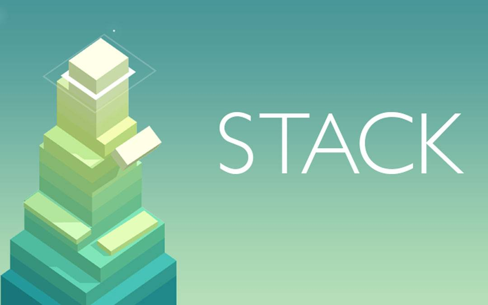

# Stack game with Cannon.JS


Stack is one of those simple, silly, addictive games that you can lose an entire afternoon to if you're not careful. Once we play this game once, we will keep trying to achieve a better scores until we're satisfied enough with the scores. Surprisingly, with three.js and cannon.js, we can make our own web based stack game.

## Step 1 Set up the scenes
First thing to do is generating the scene with three.js.
```js
scene = new THREE.Scene();
```
Then, we add mesh to the scene. Here we use the predefined BoxGeometry to fill our scene. Set up the width, height, and depth of the box.
```js
const geometry = new THREE.BoxGeometry(width, boxHeight, depth);
const color = new THREE.Color(`hsl(${30 + stack.length * 4}, 100%, 50%)`);
const material = new THREE.MeshLambertMaterial({ color });
const mesh = new THREE.Mesh(geometry, material);
mesh.position.set(x, y, z);
scene.add(mesh);
```

## Step 2 Add lights
The scene can only be seen after lights are added. Here, we will add two lights, the ambient and directional light. 

The ambient light is used to give base color for our box. Here we will set the color and intensity.
```js
const ambientLight = new THREE.AmbientLight(0xffffff, 0.6);
scene.add(ambientLight);
```
On the other hand, the directional light has a similiar setup, but it also has a position. Directional light is like a sun that shines a scene from very far away at the same angle.
```js
const dirLight = new THREE.DirectionalLight(0xffffff, 0.6);
dirLight.position.set(10, 20, 0);
scene.add(dirLight);
```
With these two lights, the box should now be clearly visible.

## Step 3 Set up the camera
On this game, we will use orthographic projection, so that things will have the same size no matter how far things are from camera.
```js
const aspect = window.innerWidth / window.innerHeight;
const width = 10;
const height = width / aspect;

camera = new THREE.OrthographicCamera(
width / -2, // left
width / 2, // right
height / 2, // top
height / -2, // bottom
0, // near plane
100 // far plane
);

camera.position.set(4, 4, 4);
camera.lookAt(0, 0, 0);
```

## Step 4 Render the images to browser
Here we use basic webGL renderer.
```js
// Set up renderer
renderer = new THREE.WebGLRenderer({ antialias: true });
renderer.setSize(window.innerWidth, window.innerHeight);
renderer.setAnimationLoop(animation);

// Add it to html
document.body.appendChild(renderer.domElement);
```

## Step 5 Setting up the game
To make this game works, we need to prepare the initial function to set up the first box and then call a speific function to keep recreating new boxes while cutting their size and lifting the camera views.
Here is the function "AddLayer" to add new box layers on top of the old ones.
```js
function addLayer(x, z, width, depth, direction) {
  const y = boxHeight * stack.length; // Add the new box one layer higher
  const layer = generateBox(x, y, z, width, depth, false);
  layer.direction = direction;
  stack.push(layer);
}
```
To separate the generation between the falling boxes and stationary ones, we need to build a new function that will tell function "generateBox" if the box is a falling one or not.
```js
function addOverhang(x, z, width, depth) {
  const y = boxHeight * (stack.length - 1); // Add the new box one the same layer
  const overhang = generateBox(x, y, z, width, depth, true);
  overhangs.push(overhang);
}
```
Notice that this function also call the "GenerateBox" function to construct new boxes.
```js
function generateBox(x, y, z, width, depth, falls) {
  // ThreeJS
  const geometry = new THREE.BoxGeometry(width, boxHeight, depth);
  const color = new THREE.Color(`hsl(${30 + stack.length * 4}, 100%, 50%)`);
  const material = new THREE.MeshLambertMaterial({ color });
  const mesh = new THREE.Mesh(geometry, material);
  mesh.position.set(x, y, z);
  scene.add(mesh);

  // CannonJS
  const shape = new CANNON.Box(
    new CANNON.Vec3(width / 2, boxHeight / 2, depth / 2)
  );
  let mass = falls ? 5 : 0; // If it shouldn't fall then setting the mass to zero will keep it stationary
  mass *= width / originalBoxSize; // Reduce mass proportionately by size
  mass *= depth / originalBoxSize; // Reduce mass proportionately by size
  const body = new CANNON.Body({ mass, shape });
  body.position.set(x, y, z);
  world.addBody(body);

  return {
    threejs: mesh,
    cannonjs: body,
    width,
    depth
  };
}
```
Next is configuring how the boxes will split if they overlap. Here, we build "splitBlockAndAddNextOneIfOverlaps" function to calculate the size of the split, center coordinate of splitted box, construct a new overhang box (the falling one)
, and add a new layer of box on top of the old ones.
```js
function splitBlockAndAddNextOneIfOverlaps() {
  if (gameEnded) return;

  const topLayer = stack[stack.length - 1];
  const previousLayer = stack[stack.length - 2];

  const direction = topLayer.direction;

  const size = direction == "x" ? topLayer.width : topLayer.depth;
  const delta =
    topLayer.threejs.position[direction] -
    previousLayer.threejs.position[direction];
  const overhangSize = Math.abs(delta);
  const overlap = size - overhangSize;

  if (overlap > 0) {
    cutBox(topLayer, overlap, size, delta);

    // Overhang
    const overhangShift = (overlap / 2 + overhangSize / 2) * Math.sign(delta);
    const overhangX =
      direction == "x"
        ? topLayer.threejs.position.x + overhangShift
        : topLayer.threejs.position.x;
    const overhangZ =
      direction == "z"
        ? topLayer.threejs.position.z + overhangShift
        : topLayer.threejs.position.z;
    const overhangWidth = direction == "x" ? overhangSize : topLayer.width;
    const overhangDepth = direction == "z" ? overhangSize : topLayer.depth;

    addOverhang(overhangX, overhangZ, overhangWidth, overhangDepth);

    // Next layer
    const nextX = direction == "x" ? topLayer.threejs.position.x : -10;
    const nextZ = direction == "z" ? topLayer.threejs.position.z : -10;
    const newWidth = topLayer.width; // New layer has the same size as the cut top layer
    const newDepth = topLayer.depth; // New layer has the same size as the cut top layer
    const nextDirection = direction == "x" ? "z" : "x";

    if (scoreElement) scoreElement.innerText = stack.length - 1;
    addLayer(nextX, nextZ, newWidth, newDepth, nextDirection);
  } else {
    missedTheSpot();
  }
}
```

## Pyhsics Explanation
The last part is adding physics to our animation with cannon.js. The physics will be mainly used to animate the falling boxes. Because cannon.js simulates the physics actions, then its world need to be initialized first.
```js
world = new CANNON.World();
world.gravity.set(0, -10, 0); // Gravity pulls things down
world.broadphase = new CANNON.NaiveBroadphase();
world.solver.iterations = 40;
```
The important thing to make sure this combination works well is what exists in Three.js needs to exist in cannon.js as well. That's why, the box also need to be generated to in canno.js. Here is the box generation for cannon.js in "GenerateBox" function. You can see that the mass of the box in cannon.js will be setted up only if it is an overhanging box (falling one).
```js
const shape = new CANNON.Box(
    new CANNON.Vec3(width / 2, boxHeight / 2, depth / 2)
);
let mass = falls ? 5 : 0; // If it shouldn't fall then setting the mass to zero will keep it stationary
mass *= width / originalBoxSize; // Reduce mass proportionately by size
mass *= depth / originalBoxSize; // Reduce mass proportionately by size
const body = new CANNON.Body({ mass, shape });
body.position.set(x, y, z);
world.addBody(body);
```
Let's head to the "cutBox" function. This function will calculate how much part of the box will be splitted and falls. Once again, what happens in three.js also have to happens in cannon.js. That's why, when we cut the rendered box in three.js, we also need to cut the physics box in cannon.js. Unlike three.js, we can't scale (resize) an object's size in cannon.js. To cut the box' size in cannon.js, simply we will remove the old one and make a new smaller one. This is the case where three.js is adjusting things and we need to sync the cannon.js.
```js
function cutBox(topLayer, overlap, size, delta) {
  const direction = topLayer.direction;
  const newWidth = direction == "x" ? overlap : topLayer.width;
  const newDepth = direction == "z" ? overlap : topLayer.depth;

  // Update metadata
  topLayer.width = newWidth;
  topLayer.depth = newDepth;

  // Update ThreeJS model
  topLayer.threejs.scale[direction] = overlap / size;
  topLayer.threejs.position[direction] -= delta / 2;

  // Update CannonJS model
  topLayer.cannonjs.position[direction] -= delta / 2;

  // Replace shape to a smaller one (in CannonJS you can't simply just scale a shape)
  const shape = new CANNON.Box(
    new CANNON.Vec3(newWidth / 2, boxHeight / 2, newDepth / 2)
  );
  topLayer.cannonjs.shapes = [];
  topLayer.cannonjs.addShape(shape);
}
```
Now, to make sure the physics from cannon.js is well synchronized with rendered box in three.js, we need to update the physics calculation every animation loop. Here we call "updatePyhsics" every animation loop. This is the case where cannon.js is adjusting things and we need to sync three.js.
```js
function updatePhysics(timePassed) {
  world.step(timePassed / 1000); // Step the physics world

  // Copy coordinates from Cannon.js to Three.js
  overhangs.forEach((element) => {
    element.threejs.position.copy(element.cannonjs.position);
    element.threejs.quaternion.copy(element.cannonjs.quaternion);
  });
}
```