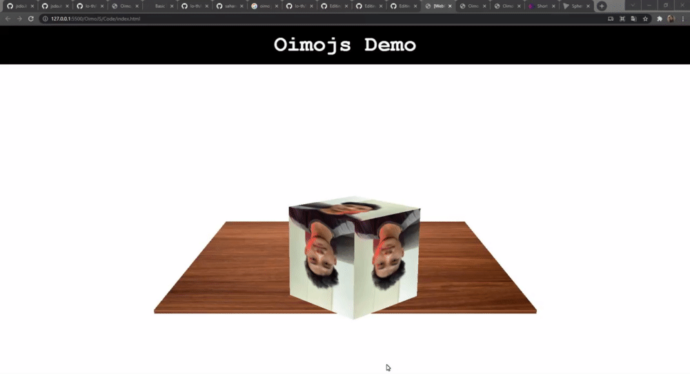

# Oimo JS

## Contents of the Presentation

* [Introduction to Oimo.js](#introduction-to-oimojs)
* [Terms in Oimo.js](#terms-in-oimojs)
* [Trying Oimojs Physics](#trying-oimojs-physics)

---

## Introduction to Oimo.js

### What is Oimo.js 🤔

Oimo.js is a lightweight 3d physics engine for JavaScript. It's a full javascript conversion of OimoPhysics. Originally created by Saharan for actionscript 3.0.

- It is really simple to use
- Lack of Documentation. (Still in progress it says). Oimo Physics has similiar syntax and use

- [Github Docs](https://github.com/lo-th/Oimo.js/)
- [Oimo.js Demo](http://lo-th.github.io/Oimo.js/#basic)


## Terms in Oimo.js

### World
World is the container of physics simulation.
#### Attribute
- **timestep** (the time between each step default 1/60 is 60 frame second)
- **iterations** (the number of iterations for constraint solvers.)
- **broadphase** (the physical simulation algorithm for collision --> 1: brute force, 2: sweep &amp; prune, 3: volume tree)
- **worldscale** (the scale of the world, world system units is 0.1 to 10 meters max for dynamic body can be multiplied by this number)
- **random** (true or false, add random number in simulation)
- **info** (to enable simulation statistic display)
- **gravity** (an array to define the value of gravity [ x, y, z ])

#### Function
- world.step() for the world to take a step once.
- world.clear() Reset the world and remove all rigid bodies, shapes, joints and any object from the world
- world.getinfo() return string of simulation statistic if enabled
- world.setgravity( [ x, y, x] ) set the world gravity 
- world.add({}) add someting to world

#### Example
```javascript
world = new OIMO.World({ 
    timestep: 1/60, 
    iterations: 8, 
    broadphase: 2, // 1 brute force, 2 sweep and prune, 3 volume tree
    worldscale: 1, // scale full world 
    random: true,  // randomize sample
    info: false,   // calculate statistic or not
    gravity: [0,-9.8,0] 
});
```

### Rigid Body

Rigid Body is a physical object that resides in the world such as Sphere, Box, Cylinder.

#### Attribute
```javascript
    type:'sphere', // type of object : sphere, box, cylinder 
    size:[1,1,1], // size of object
    pos:[0,0,0], // starting position coordinate
    rot:[0,0,90], // start rotation in degree
    move:true, // dynamic or statique
    density: 1, // density of the object
    friction: 0.2, // the friction of the object
    restitution: 0.2, // the restitution of object (bounce)
    belongsTo: 1, // The bits of the collision groups to which the object belongs.
    collidesWith: 0xffffffff // The bits of the collision groups with which the shape collides.
```

## Trying Oimojs Physics

#### 1. Setting up Three.js and Oimo.js in HTML
There is 2 way to use Oimo.js
Download the [minified library](http://lo-th.github.io/Oimo.js/build/oimo.min.js) and include it in your HTML.<br>
Alternatively, use **Node** and install the [package](https://www.npmjs.com/package/oimo): `npm install oimo`<br><br>
Using minified library
```html
<!-- Three js -->
<script src="https://rawcdn.githack.com/mrdoob/three.js/r89/build/three.min.js"></script>

<!-- GLTFJLoader.js r89-->
<script src="https://rawcdn.githack.com/mrdoob/three.js/r89/examples/js/loaders/GLTFLoader.js"></script>

<!-- TrackballControls.js -->
<script src="https://rawcdn.githack.com/mrdoob/three.js/r89/examples/js/controls/TrackballControls.js"></script>

<!-- oimo.js v1.0.9  -->
<!-- Updated version in Oimojs github repo -->
<script src="https://unpkg.com/oimo@1.0.9/build/oimo.min.js"></script>
<div id="container"></div>
<script type="text/javascript" src="index.js"></script>
```

#### 2. Setting up Threejs 
Open up index.js and declare this variable first
```js
// Get Container From HTML
var container;
// Variable for Camera, Scene, And Renderer
var camera, scene, renderer;
// For Oimojs World
var world;
// Trackball for Camera
var trackball;
// Variable for Ground
var meshGround;
var groundBody;
// Variable for Cube
var meshCube;
var body;
// Variable for Ball
var meshBall;
var bodyBall;
```
Then we can make the object, camera, scene,and renderer with Threejs
```js
// Threejs
function initThree() {
    // Container
    container = document.getElementById('container');

    // Camera and Scene
    camera = new THREE.PerspectiveCamera(30, window.innerWidth / window.innerHeight, 1, 1000);
    camera.position.y = 100;
    camera.position.z = 400;
    scene = new THREE.Scene();

    // Texture Loader
    var loader = new THREE.TextureLoader();
    var texturejaprun = loader.load('img/japrun.jpg');  
    var textureground = loader.load('img/woodentexture.jpg');
    var textureishaq = loader.load('img/ishaq.jpg');

    // Material Texture
    var material = new THREE.MeshBasicMaterial({map: texturejaprun});
    var groundmaterial = new THREE.MeshBasicMaterial({map: textureground});
    var ballmaterial = new THREE.MeshBasicMaterial({map: textureishaq});

    // Ground Object
    var geometryGround = new THREE.BoxGeometry(200, 2, 200);
    meshGround = new THREE.Mesh(geometryGround, groundmaterial);
    meshGround.position.y = -20;
    scene.add(meshGround);

    // Cube Object
    var geometryCube = new THREE.BoxGeometry(50, 50, 50);
    meshCube = new THREE.Mesh(geometryCube, material);
    scene.add(meshCube);

    // Ball Object
    var geometryBall = new THREE.SphereGeometry(20, 32, 16);
    meshBall = new THREE.Mesh(geometryBall, ballmaterial);
    scene.add(meshBall);

    // Renderer
    renderer = new THREE.WebGLRenderer();
    renderer.setClearColor(0xffffff);
    renderer.setSize(window.innerWidth, window.innerHeight);
    container.appendChild(renderer.domElement);

    // Trackball for Camera
    trackball = new THREE.TrackballControls(camera);
}
```
#### 3. Setting up Oimo
lets setup the world physics and the physics of the object
add this code on top of initThree function
```js
function initOimo() {
    world = new OIMO.World({ 
        timestep: 1/30, 
        iterations: 8, 
        broadphase: 2, // 1 brute force, 2 sweep and prune, 3 volume tree
        worldscale: 1, // scale full world 
        random: true,  // randomize sample
        info: false,   // calculate statistic or not
        gravity: [0,-9.8,0] 
    });

    // Ground
    var groundBody = world.add({
        type: "box",
        size: [200, 2, 200],
        pos: [0, -20, 0],
        rot: [0, 0, 0],
        move: false,
        density: 1,
        friction: 0.5,
        restitution: 0.1,
    });
    // Cube
    body = world.add({
        type: "box",
        size: [50, 50, 50],
        pos: [0, 100, 0],
        rot: [45, 45, 0],
        move: true,
        density: 1,
        friction: 0.5,
        restitution: 0.2
    });
    // Ball
    bodyBall = world.add({
        type: "sphere",
        size: [20, 32, 16],
        pos: [0, 50, 0],
        rot: [45, 45, 0],
        move: true,
        density: 1,
        friction: 0.5,
        restitution: 0.2
    });
}
```
#### 4. Add Render and Animate Function
to visualize the world and object we need to have render function
add this two function in your code
```js
// render Function
function render() {
    renderer.render(scene, camera);
}
```
```js
// Animate Function
function animate() {
    trackball.update();
    requestAnimationFrame(animate);
    updatePhysics();
    render();
}

```
#### 5. add UpdatePhysics Function
the object we make in Threejs is seperate entity with the Oimojs so we need to constantly update them to visualize what happen
in the next code is to keep updating the object that move (in this case Cube and Ball)
```js
// Sync Model & Physics
function updatePhysics() {
    world.step();

    // Cube 
    meshCube.position.x = body.position.x;
    meshCube.position.y = body.position.y;
    meshCube.position.z = body.position.z;
    meshCube.quaternion.x = body.quaternion.x;
    meshCube.quaternion.y = body.quaternion.y;
    meshCube.quaternion.z = body.quaternion.z;
    meshCube.quaternion.w = body.quaternion.w;

    // Ball
    meshBall.position.x = bodyBall.position.x;
    meshBall.position.y = bodyBall.position.y;
    meshBall.position.z = bodyBall.position.z;
    meshBall.quaternion.x = bodyBall.quaternion.x;
    meshBall.quaternion.y = bodyBall.quaternion.y;
    meshBall.quaternion.z = bodyBall.quaternion.z;
    meshBall.quaternion.w = bodyBall.quaternion.w;
   
}
```
#### 6. Run The Function
Add this at the end of the file to run the code
```js
// Run the Function
initOimo();
initThree();
animate();
```

The Final Result should be a view like the gif below<br>
Note : in your code the color would be black because there is no image file for the texture <br><br>


The Final Code cane be found [Here](https://github.com/cg2021c/threejs-presentation-vincent-dan-teman-teman/blob/8c6c50878cdeb8f4ecb475648325a953c615eab9/OimoJS/Code/index.js)


