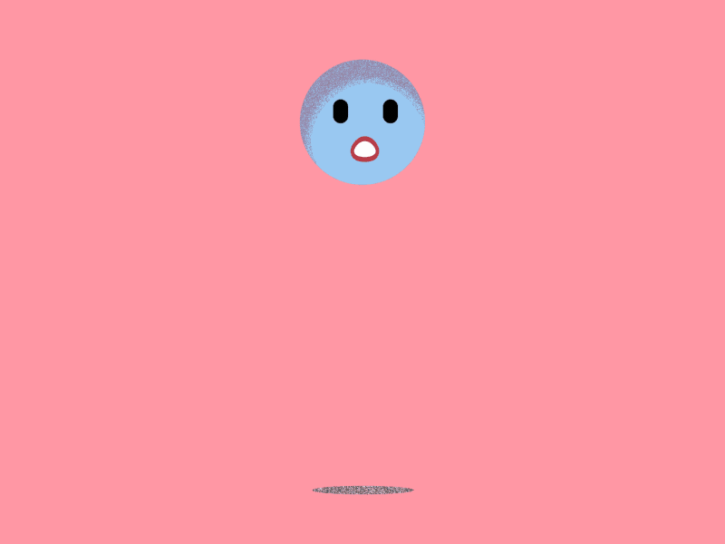

# Material Properties
> To slide or to bounce?

In this example, there will be an empty box/container similar to the previous example. But right now, this container will rotate up and down around it's *x axis*. There will be a menu on the top-right corner that can modify properties for Physijs in this scene.

The [code](https://github.com/cg2021c/threejs-presentation-vincent-dan-teman-teman/blob/main/Physijs/Code/src/chapter-12/js/12-02.js) 
and [preview](https://cg2021c.github.io/threejs-presentation-vincent-dan-teman-teman/Physijs/Code/src/chapter-12/02-material.html) for this section.

## Friction
The friction slider will modify the "roughness" of a Physijs material. The higher the friction, the harder it is for either cube or spheres to start sliding once the ground isn't level. In other words, it affects the acceleration of that Physijs material.


## Restitution
The restitution slider will modify how much energy an object possesses is restituted when it collides. The higher the restitution, the bouncier the cubes or spheres becomes after they hit other objects.



## Adding Shapes
The code below is used to add spheres to the scene.
```js
var sphere = new Physijs.SphereMesh(new THREE.SphereGeometry(2, 20),
    Physijs.createMaterial(
        new THREE.MeshStandardMaterial({ color: colorSphere }),
        controls.sphereFriction, controls.sphereRestitution)
    );
sphere.position.set(Math.random() * 50 - 25, 20 + Math.random() * 5, Math.random() * 50 - 25);
meshes.push(sphere);
scene.add(sphere);
```
To create a sphere from `THREE.SphereGeometry`, `Physijs.SphereMesh` will be used as its mesh because it is the best match from the set of meshes provided. 

When creating a `Physijs.SphereMesh`, our geometry will be passed in and we'll use `Physijs.createMaterial` to create a Physijs-specific material. This will enable us to set *friction* and *restitution* for this object.