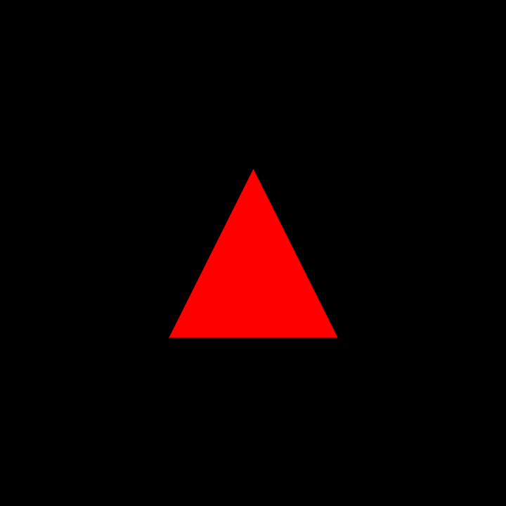

# Supported Shapes
> More shapes!



Physijs provides a number of shapes that can be used to wrap geometries. To use these meshes, all you need to do is replace the `THREE.Mesh` constructor with one of these available meshes.

The [code](https://github.com/cg2021c/threejs-presentation-vincent-dan-teman-teman/blob/main/Physijs/Code/src/chapter-12/js/12-03.js) 
and [preview](https://cg2021c.github.io/threejs-presentation-vincent-dan-teman-teman/Physijs/Code/src/chapter-12/03-shapes.html) for this section.

## Physijs Meshes
Available meshes in Physijs.

| Name | Description |
| ----------- | ----------- |
| Physijs.PlaneMesh | Used to create a zero-thickness plane. |
| Physijs.BoxMesh | Used for geometries that look like cubes (`THREE.BoxGeometry`). |
| Physijs.SphereMesh | Used for sphere shapes (`THREE.SphereGeometry`). |
| Physijs.CylinderMesh | Used for normal cylinders, with the same top and bottom radius (`THREE.Cylinder`). |
| Physijs.ConeMesh | Used for cylinders, where the top radius is Θ and the bottom one is a positive value. |
| Physijs.CapsuleMesh | Used for cylinders with rounded top and bottom. |
| Physijs.ConvexMesh | Used for rough shapes that can be used to create more complex objects. Creates a convex to approximate the shape of complex objects (`THREE.ConvexGeometry`) |
| Physijs.ConcaveMesh | Used for a more detailed representation of complex geometries. Has higher performance penalty compared to creating separate geometries. |
| Physijs.HeightfieldMesh | Used to create a height field from `THREE.PlaneGeometry`. |

## Snippets
Here are a few code snippets for the available meshes.
- Plane Mesh:
```js
var plane = new Physijs.PlaneMesh(new THREE.PlaneGeometry(5, 5, 10, 10), getMaterial());
...
```
- Sphere Mesh:
```js
var sphere = new Physijs.SphereMesh(new THREE.SphereGeometry(3, 20), getMaterial());
...
```
- Box Mesh:
```js
var cube = new Physijs.BoxMesh(new THREE.BoxGeometry(4, 2, 6), getMaterial());
...
```
- Cylinder Mesh:
```js
var cylinder = new Physijs.CylinderMesh(new THREE.CylinderGeometry(2, 2, 6), getMaterial());
...
``` 
- Cone Mesh:
```js
var cone = new Physijs.ConeMesh(new THREE.CylinderGeometry(0, 3, 7, 20, 10), getMaterial());
...
```
- Capsule Mesh: 
```js
// after merging a cylinder and 2 sphere geometries
...
var capsule = new Physijs.CapsuleMesh(merged, getMaterial());
...
```
- Convex Mesh:
```js
var convex = new Physijs.ConvexMesh(new THREE.TorusKnotGeometry(3.5, 2.3, 64, 8, 2, 3, 10), getMaterial());
...
```