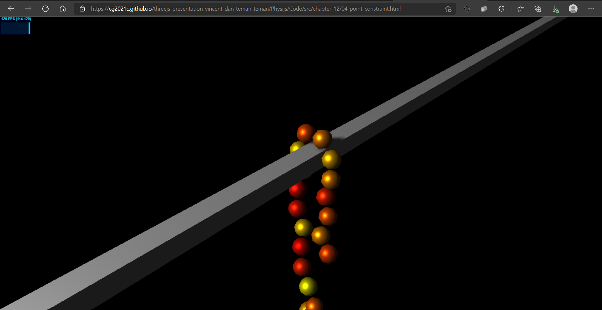

# Using PointConstraint to limit movement between two points

If you open the 04-point-contstraint.html example, you see the following:

## <a href="https://github.com/cg2021c/threejs-presentation-vincent-dan-teman-teman/blob/main/Physijs/Code/src/chapter-12/js/12-04.js">Source Code</a>  
## <a href="https://cg2021c.github.io/threejs-presentation-vincent-dan-teman-teman/Physijs/Code/src/chapter-12/04-point-constraint.html">Preview</a>



In this example, we rendered a horizontal bar on which a chain of beads is
dropped. When you open this example, you can see that the beads curl
themselves around the bar, before falling out of the screen. This happens
because each bead uses a PointConstraint to keep a certain distance to its
neighbor. So, as soon as one side is heavier then the other, gravity and this constraint will make sure the chain slides over the horizontal bar.

## Code Explanation
1. Here, you can see that we create objects using a Physijs-specific mesh (SphereMesh in this case) :  
```js
var bead = new THREE.SphereGeometry(0.5);
var physBead = new Physijs.SphereMesh(bead, Physijs.createMaterial(
new THREE.MeshStandardMaterial({color: scale(Math.random()).hex()}), 0, 0));
```

2. Add them to the scene :
```js
physBead.position.set(i * (-rangeMin + rangeMax)/count + rangeMin, 10, Math.random()/2);
scene.add(physBead);
```

3. We also connect each bead to the previous one using a Physijs.PointConstraint. To create this constraint, we have to define three parameters:
- The first two arguments define which objects you want to connect to one
another. In this case, we connect two spheres to each other.
- The third argument defines to what position the constraint is bound. For
instance, if you want to connect two objects together, a good choice is to just set it to the
position of the second object (which is the center of the sphere).
```js
var beadConstraint = new Physijs.PointConstraint(beads[i-1], physBead, physBead.position);
```

4. Once the constraint is created, we can enable it by adding it to the scene with
the addConstraint function. 
```js
scene.addConstraint(beadConstraint);
```