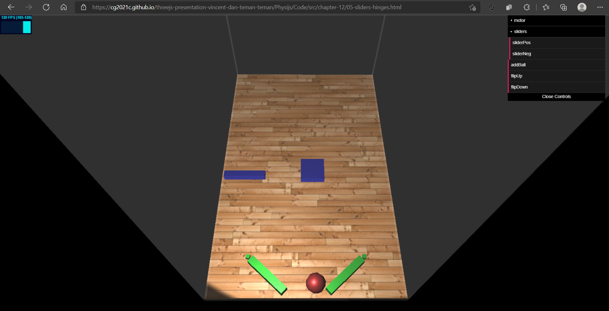

# Hinge constraints

HingeConstraint, as the name implies, allows you to create an object that
behaves like a hinge. It rotates around a specific axis, limiting the movement
to a specified angle. In our example, HingeConstraint is shown with two green
flippers at the bottom of the scene (example, 05-sliders-hinges.html):

## <a href="https://github.com/cg2021c/threejs-presentation-vincent-dan-teman-teman/blob/main/Physijs/Code/src/chapter-12/js/12-05.js">Source Code</a>  
## <a href="https://cg2021c.github.io/threejs-presentation-vincent-dan-teman-teman/Physijs/Code/src/chapter-12/05-sliders-hinges.html">Preview</a>



These flippers are constrained to the small cubes and can rotate around them.
If you want to play around with these hinges, you can enable them by clicking
the flipUp and flipDown buttons in the menu. 

## Code Explanation
1. Let’s take a closer look at how we created one of these flippers:
```js
var flipperLeft = new Physijs.BoxMesh(new THREE.BoxGeometry(12, 2, 2), mat, 10);
flipperLeft.position.x = -8;
flipperLeft.position.y = 2;
flipperLeft.position.z = 30;
flipperLeft.castShadow = true;
scene.add(flipperLeft);
var flipperLeftPivot = new Physijs.SphereMesh(new THREE.BoxGeometry(1, 1, 1), mat, 0);
flipperLeftPivot.position.y = 2;
flipperLeftPivot.position.x = -15;
flipperLeftPivot.position.z = 30;
flipperLeftPivot.rotation.y = 1.4;
flipperLeftPivot.castShadow = true;
scene.add(flipperLeftPivot);
}
```

2. This constraint takes four parameters. Let’s look at each one in a bit more detail:

Parameter  | Description  | 
---------|------
mesh_a | Object that is to be constrained in its movements. In this example, rectangle that serves as the flipper.
mesh_b | The second object defines to which object mesh_a is constrained. In this example, mesh_a is constrained to the small cube. If we move this mesh around, mesh_a would follow it around.
position | This is the point where the constraint is applied. In this case, it’s the hinge point around which mesh_a rotates. If you’ve specified mesh_b, this hinge point will move around with the position and rotation of mesh_b.
axis | This is the axis around which the hinge should rotate. In this example, we’ve set the hinge horizontally (0,1,0).

```js
var constraint = new Physijs.HingeConstraint(flipperLeft, flipperLeftPivot, flipperLeftPivot.position,
new THREE.Vector3(0, 1, 0));
```

3. Adding HingeConstraint to the scene works in the same way as we’ve seen
with PointConstraint.
```js
scene.addConstraint(constraint);
```

4. For HingeConstraint, however, we also need
to define the range of movement that is allowed. We do this with
the setLimits function. This function takes the following four parameters:

Parameter  | Description  | 
---------|------
low | This is the minimum angle, in radians, of motion
high | This is the maximum angle, in radians, of motion.
bias_factor | This property defines the rate at which the constraint corrects itself after an error in position.
relaxation_factor | This defines the rate at which the velocity is changed by the constraint. If this is set to a high value, the object will bounce when it reaches its minimum or maximum angle of motion.

```js
constraint.setLimits(-2.2, -0.6, 0.3, 0.5);
```

5. The following code is used to enable this motor:
```js
constraint.enableAngularMotor( controls.velocity, controls.acceleration );
```
This will speed up the flipper to the specified velocity using the acceleration provided. 

6. To disable a motor, we can just call the following code:
```js
flipperLeftConstraint.disableMotor();
```