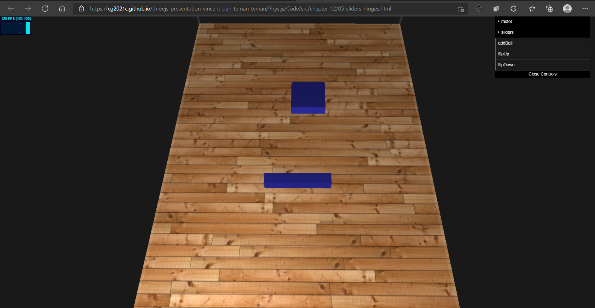

# Limiting movement to a single axis with SliderConstraint

The next constraint is SliderConstraint. With this constraint, you can limit the movement of an object to any one of its axes. The blue sliders in the 05-sliders-hinges.html example can be controlled from the sliders submenu. The sliders can only move on their defined axis. The top one will move up and down, and the bottom one can move from left to right:

## <a href="https://github.com/cg2021c/threejs-presentation-vincent-dan-teman-teman/blob/main/Physijs/Code/src/chapter-12/js/12-05.js">Source Code</a>  
## <a href="https://cg2021c.github.io/threejs-presentation-vincent-dan-teman-teman/Physijs/Code/src/chapter-12/05-sliders-hinges.html">Preview</a>



With the sliderPos button, the sliders will move to the left-hand side, and with the sliderNeg button, they will move to the right-hand side. 

## Code Explanation

1. Let’s take a closer look at how we created one of these slider:
```js
var sliderSphere = new THREE.BoxGeometry(7, 2, 7);
var sliderMesh = new Physijs.BoxMesh(sliderSphere, mat, 100);
sliderMesh.position.z = -15;
sliderMesh.position.x = 2;
sliderMesh.position.y = 1.5;
scene.add(sliderMesh);
```

2. This constraint takes three arguments (or four if
you want to constrain an object to another object). The following table
explains the arguments for this constraint:

Parameter  | Description  | 
---------|------
mesh_a | Object that is to be constrained in its movements. In this example, rectangle that serves as the slider.
mesh_b | The second object defines to which object mesh_a is constrained. This is an optional argument and omitted in this example. If omitted, the mesh will be constrained to the scene.
position | This is the point where the constraint is applied.
axis | This is the axis on which mesh_a will slide. 

```js
var constraint = new Physijs.SliderConstraint(sliderMesh,
new THREE.Vector3(-15, 2, 1.5),
new THREE.Vector3(Math.PI / 2, 0, 0));
```

3. Adding SliderConstraint to the scene
```js
scene.addConstraint(constraint);
```

4. Set the constraint to specify how far the slider may slide. You can set the following limits on SliderConstraint:

Parameter  | Description  | 
---------|------
linear_lower | This is the lower linear limit of the object.
linear_upper | This is the upper linear limit of the object.
angular_lower | This is the lower angular limit of the object.
angular_higher | This is the upper angular limit of the object.

```js
constraint.setLimits(-18, 18, 0.5, -0, 5);
```

5. Set the restitution (the bounce) that’ll occur when you hit one
of these limits. Where the first parameter sets the amount of bounce when you hit the linear limit and the second one sets the amount of bounce when you hit the angular
limit.
```js
constraint.setRestitution(0.1, 0.1);
```